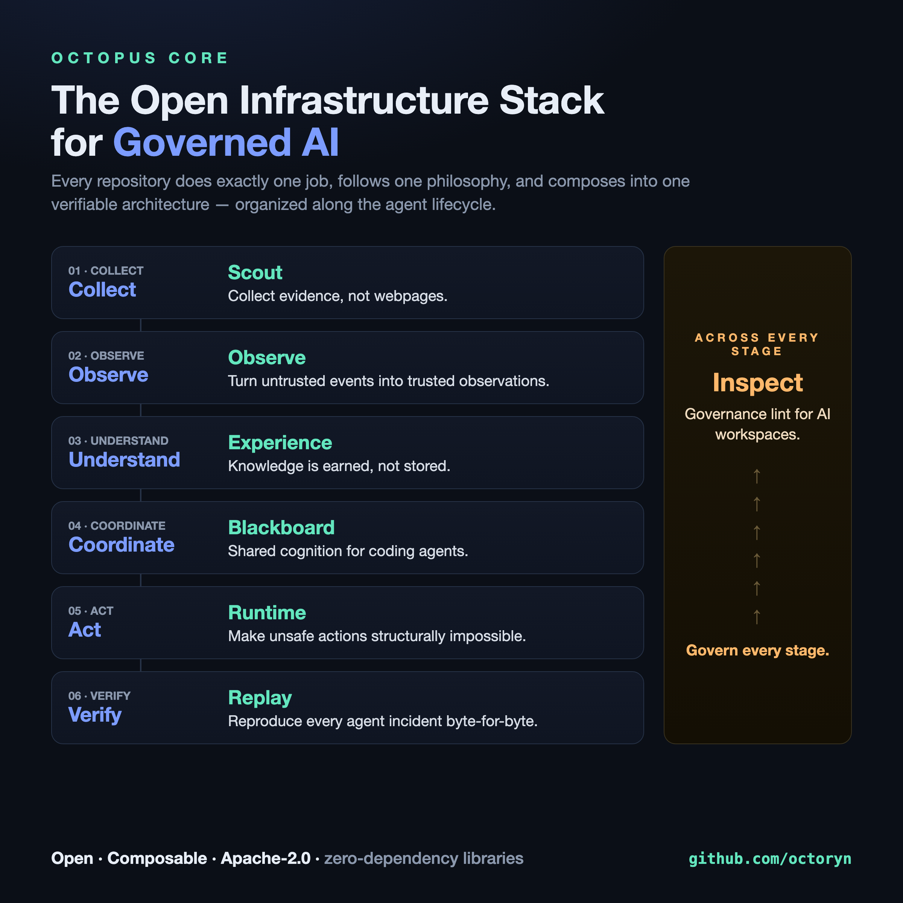

<div align="center">

# Octopus Core

**The open infrastructure stack for governed AI systems.**

Every repository does exactly one job, follows one philosophy, and composes into one verifiable architecture — organized along the agent lifecycle.



</div>

## The stack

| Stage | Repo | One job |
|---|---|---|
| **Collect** | [Scout](https://github.com/octoryn/octopus-scout) | Collect evidence, not webpages. |
| **Observe** | [Observe](https://github.com/octoryn/octopus-observe) | Turn untrusted events into trusted observations. |
| **Understand** | [Experience](https://github.com/octoryn/octopus-experience) | Knowledge is earned, not stored. |
| **Coordinate** | [Blackboard](https://github.com/octoryn/octopus-blackboard) | Shared cognition for coding agents. |
| **Act** | [Runtime](https://github.com/octoryn/octopus-runtime) | Make unsafe actions structurally impossible. |
| **Verify** | [Replay](https://github.com/octoryn/octopus-replay) | Reproduce every agent incident byte-for-byte. |
| **Govern** *(every stage)* | [Inspect](https://github.com/octoryn/octopus-inspect) | Governance lint for AI workspaces. |

```
Collect → Observe → Understand → Coordinate → Act → Verify
 Scout     Observe   Experience   Blackboard  Runtime  Replay
                    Inspect governs every stage
```

## Install

Live on npm today — zero-dependency, Apache-2.0, published with provenance:

```bash
npm i octopus-runtime          # governed execution runtime
npm i -g octopus-inspect       # governance linter →  octopus-inspect .
npm i -g octopus-replay        # determinism harness →  octopus-replay --help
```

The rest are usable from source now and rolling out to npm.

## Principles

1. **Observation precedes reasoning** — *Observe*
2. **Trust must be earned** — *Experience*
3. **Unsafe execution must be impossible** — *Runtime*
4. **Every action must be reproducible** — *Replay*
5. **Governance begins before runtime** — *Inspect*
6. **Agents think together** — *Blackboard*

## Also in the family

- [octopus-linkedin](https://github.com/octoryn/octopus-linkedin) — a governance example: *draft → review → approve → publish*, the stack's discipline applied to a real outward action.
- [octopus-agentos](https://github.com/octoryn/octopus-agentos) — an enterprise AI development environment (the stack's distribution form).

---

**Open · Composable · [Apache-2.0](https://www.apache.org/licenses/LICENSE-2.0) · zero-dependency libraries.** No black boxes, no SaaS lock-in — built to be forked, audited, and composed into your own systems.
